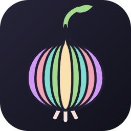

# Onion Theme

<p align="center"></p>

A night & day theme system for VS Code, tuned for **JavaScript, TypeScript and Python**.

<p align="center"><a href="images/demo.mp4"></a><br><sub>Click for the full-quality video</sub></p>

- **10 color themes**: 5 palettes × Night (dark) / Day (light)
- **Two file icon themes** (JS/TS/Python-aware: tests, `.d.ts`, `__init__.py`, `pyproject.toml`, venvs, caches…)
  - **Onion Classic Icons**: rounded language badges, document shapes, plain folders
  - **Onion Bulb Icons**: every file is an onion bulb with a label or glyph; folders carry a sliced-onion ring; the workspace root is a whole onion
- **Onion Product Icons**: solid (filled) icons for the activity bar, explorer, SCM, debug, tabs and symbols
- **Settings** for accent, borders, sidebar contrast, italics, folder color and automatic day/night switching

| Palette | Night | Day |
|---|---|---|
| Red | aubergine, purple/magenta | warm paper, deep plum |
| Shallot | dark cocoa, rose/copper | blush paper, terracotta |
| Scallion | deep forest, green/lime | pale sage, deep green |
| Leek | slate-teal, teal | cool mist, petrol blue |
| Mocha | Catppuccin Mocha | Catppuccin Latte (contrast-boosted) |

Every syntax color meets WCAG AA (4.5:1) on its editor background, body text meets AAA (7:1). The build enforces it.

## Use

1. **Preferences: Color Theme** → `Onion <Palette> Night|Day`
2. **Preferences: File Icon Theme** → `Onion Classic Icons` or `Onion Bulb Icons`
3. **Preferences: Product Icon Theme** → `Onion Product Icons`

## Settings

| Setting | Default | |
|---|---|---|
| `onion.accent` | `default` | `red rose peach yellow green teal sky blue mauve lavender` or `#rrggbb` |
| `onion.bordered` | `false` | 1px borders between sidebar, editor, panel, tabs |
| `onion.contrastSidebar` | `false` | darkest background for sidebar + panel |
| `onion.italic` | `true` | italic comments, docstrings, params, `self`/`this`, decorators, type params |
| `onion.folderColor` | `accent` | `accent` or `neutral` folder icons |
| `onion.dayNight` | `off` | `os` follows the OS light/dark mode, `schedule` switches at the times below |
| `onion.dayStart` / `onion.nightStart` | `07:00` / `19:00` | schedule times (local) |

Style settings rewrite the theme files and ask for a window reload (VS Code only reads theme files on load).
Commands: **Onion: Select Accent**, **Onion: Toggle Day/Night**, **Onion: Reset Customizations**.

## Develop

```sh
npm install
npm run build      # generates themes/ + icon font, updates package.json contributes, runs contrast/icon checks
npm run package    # -> onion-theme-<version>.vsix
codium --install-extension onion-theme-0.1.0.vsix   # or: code --install-extension …
```

Press **F5** to open an Extension Development Host with `samples/` (JS, TS, TSX, Python fixtures).

- Palettes: `src/palettes.js` (add a palette = add one object)
- UI colors: `src/colors.js` · syntax: `src/syntax.js` · file icons: `src/file-icons.js` · product icons: `src/product-icons.js`
- `themes/` and `icons/product/` are generated, don't edit by hand.

## Credits

Onion Mocha uses colors from [Catppuccin](https://github.com/catppuccin/catppuccin) (MIT).
